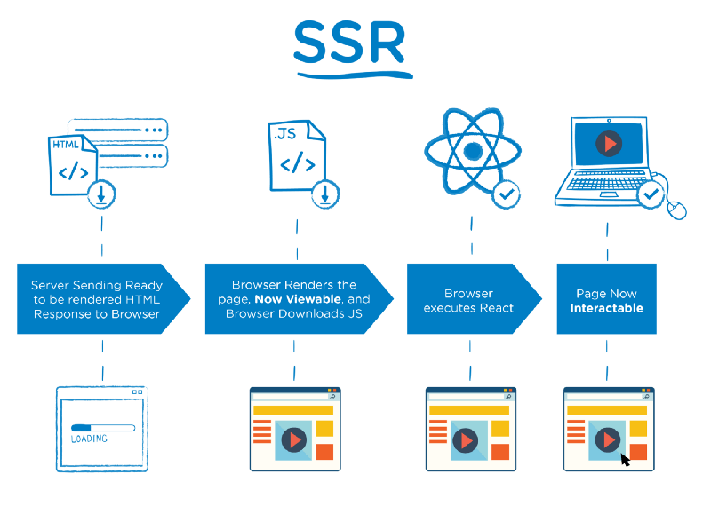

# Flash lecture - Next.js

The basics of Next.js, a React framework.

## Table of Contents

- [Setup](#setup)
- [Getting started](#getting-started)
- [Why use Next.js](#why-use-nextjs)
  - [Advantages of SPAs](#advantages-of-spas)
  - [Disadvantages of SPAs](#disadvantages-of-spas)
  - [The best of both worlds](#the-best-of-both-worlds)
  - [Pre-rendering](#pre-rendering)
    - [Static Site Generation (SSG)](#static-site-generation--ssg-)
    - [Server-Side Rendering (SSR)](#server-side-rendering--ssr-)
- [Create pages](#create-pages)
- [Page titles](#page-titles)
- [Link pages](#link-pages)
  - [Dynamic routes](#dynamic-routes)
- [Static HTML export](#static-html-export)
  - [Statically generate routes with variable params](#statically-generate-routes-with-variable-params)
    - [exportTrailingSlash](#exporttrailingslash)
- [Alternatives to Next.js](#alternatives-to-nextjs)
  - [Gatsby](#gatsby)
  - [Nuxt](#nuxt)

## Setup

```bash
npm install
```

```bash
npm run dev
```

## Getting started

To initialize a new Next.js app, just

```bash
npx create-next-app
```

## Why use Next.js

### Advantages of SPAs

1 - **UX**: With frontend navigation, page transition effects, load content on demand, the user experience is very good and very smooth, once the app code is loaded initially on first request.

2 - **Component-based approach**: Easy to share HTML/JS components across views and reutilize code.

### Disadvantages of SPAs

1 - **Search Engine Optimization**: Since search engines depend on HTML content and all content is rendered through JS in the frontend in an SPA, some search engines may not see the full content of the page, or individual title, metatags and description per page. That can lead to poor ratings on SEO

2 - **Speed**: Initial page loads in SPA can be slow, as the client needs to load the whole JS code for the whole application, and then render the appropriate content. Pre-rendered HTML content, on the other hand, makes intial load faster in the browser.

3 - **Hard to scale**: `create-react-app` or equivalent only offer a basic scaffolding structure, but for larger projects it can be complicated to decide on folder structure and best practices.

4 - **Social Network sharing**: Social networks (Facebook, Twitter...) can't read metadata generated with JS, as they only read static HTML. This makes it impossible to share and preview pages generated with JS in the client.

### The best of both worlds

https://www.youtube.com/watch?v=yZ7ywrl5oMo&ab_channel=GanarlyFilms

How can we get all the benegits from SPAs without loosing the advantadges that classic websites give us?

Next.js and other frameworks will pre-render our HTML content on server side and send it to the client.

Each generated HTML is associated with minimal JavaScript code necessary for that page. When a page is loaded by the browser, its JavaScript code runs and makes the page fully interactive. (This process is called _hydration_.)



### Pre-rendering

#### Static Site Generation (SSG)

The HTML is generated at build time and will be reused on each request.

Recommended for sites that don't change its content often (blogs, marketing websites, information...)

#### Server-Side Rendering (SSR)

The HTML is generated on each request.

Useful for pages that change content dynamically or on a per-request basis.

Using cache can be a solution to avoid server overload.

## Create pages

In the `/pages` directory you can create your components that will act as **pages** (components mapped to Router routes)

https://nextjs.org/docs/basic-features/pages

For example, file `/pages/about.js` will be mapped to route `/about`.

Read the documentation for rules on creating pages and dynamic routes.

https://nextjs.org/docs/routing/introduction

## Page titles

Use the `<Head>` component to declare content for the `head` of the HTML document.

```js
<Head>
  <title>Create Next App</title>
  <link rel="icon" href="/favicon.ico" />
</Head>
```

## Link pages

Import the `Link` component:

```js
import Link from "next/link";
```

And use it with a `href` prop:

```html
<Link href="/about">
  <a>About Us</a>
</Link>
```

### Dynamic routes

https://nextjs.org/docs/routing/dynamic-routes

`/pages/posts/[id].js` will make the `id` param available in your route params through `useRouter`. It's called `query` instead of `params`.

```js
import { useRouter } from "next/router";

const Post = () => {
  const router = useRouter();
  const { id } = router.query;

  return <p>Post: {id}</p>;
};

export default Post;
```

## Static HTML export

https://nextjs.org/docs/advanced-features/static-html-export

`next export` allows you to export your app to static HTML, which can be run standalone without the need of a Node.js server.

In your package.json, add:

```js
"export": "next build && next export"
```

Generate static HTML files with

```bash
npm run export
```

which will put all generated files in the `/out` directory.

### Statically generate routes with variable params

https://nextjs.org/docs/basic-features/data-fetching#getstaticpaths-static-generation

#### exportTrailingSlash

https://nextjs.org/docs/api-reference/next.config.js/trailing-slash

Create file `next.config.js` and add:

```js
module.exports = {
  exportTrailingSlash: true,
};
```

## Alternatives to Next.js

### Gatsby

Offers a similar approach to Next, also built on top of React

### Nuxt

The _equivalent_ to Next for 💚Vue💚.
